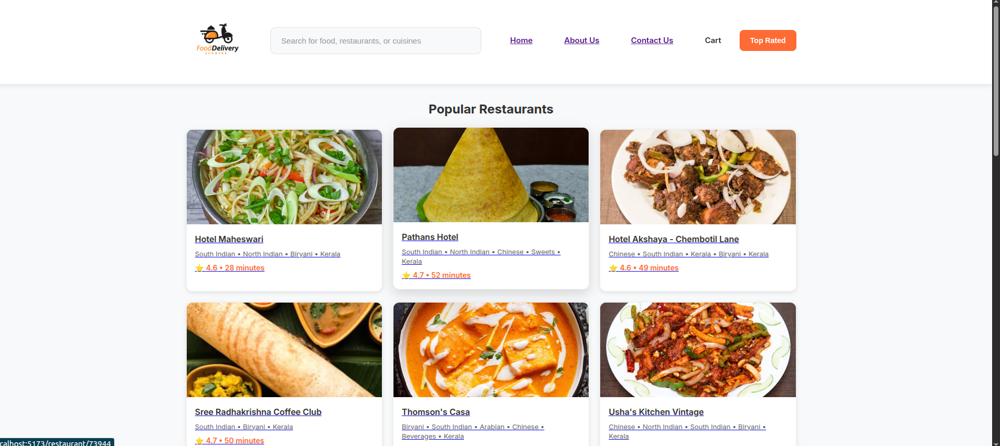
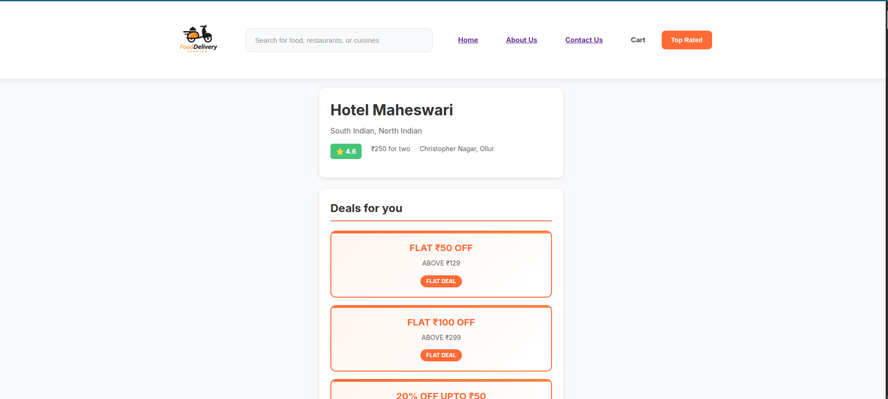

# Food Delivery App - Learning Project

A React learning project inspired by food delivery apps like Swiggy.  
The goal of this project is to practice modern web development concepts including component architecture, responsive design, and dynamic data rendering.

## Project Screenshots




## How to Run Locally

1. **Clone the repository**

   ```bash
   git clone https://github.com/AISWARYAJAYADAS/namaste-react.git
   cd namaste-react
   ```

2. **Install dependencies**

   ```bash
   npm install
   ```

3. **Start development server**

   ```bash
   npm run dev
   ```

4. **Open in browser**
   ```
   http://localhost:5173
   ```

## Rough UI Sketch


## UI Components

- **Header**: Logo and navigation menu
- **Body**: Search bar and restaurant cards
- **Footer**: Company information and links

## Tech Stack

- React 19
- Vite
- React Router
- CSS3

## Current Features

**Completed:**

- Header with logo, search functionality, and navigation
- Restaurant listing with cards
- Search and filter functionality
- Individual restaurant menu pages
- Responsive design
- Loading states with Shimmer UI
- Error handling
- React Router navigation

## Next Steps

- Optimize app performance
- Improve UI/UX design
- Add Redux Toolkit for state management
- Implement testing

## Planned Enhancements

- Optimize app performance
- Improve UI/UX design
- Add Redux Toolkit for state management
- Implement testing

## Acknowledgments

- Design inspiration from Swiggy
- Learning from Namaste React course
