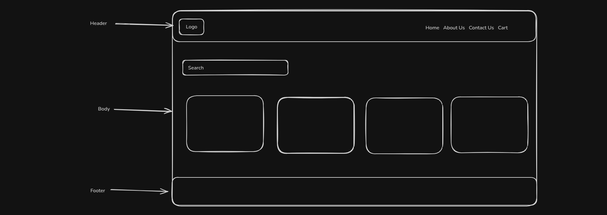
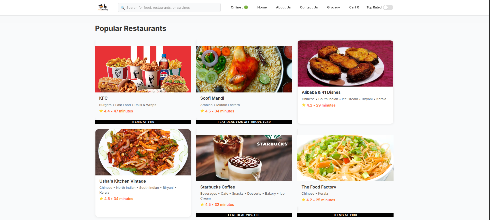
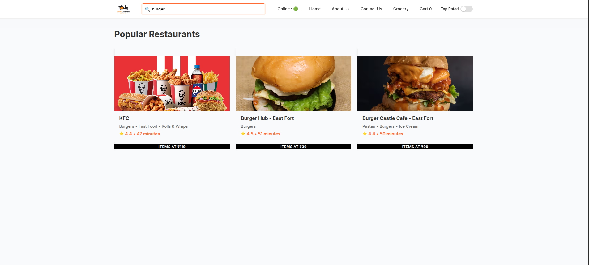
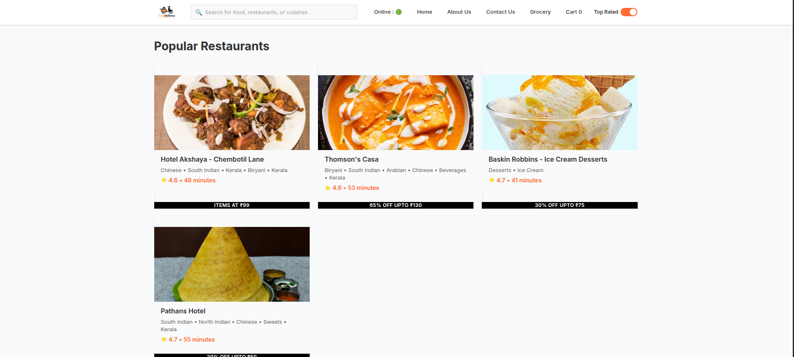
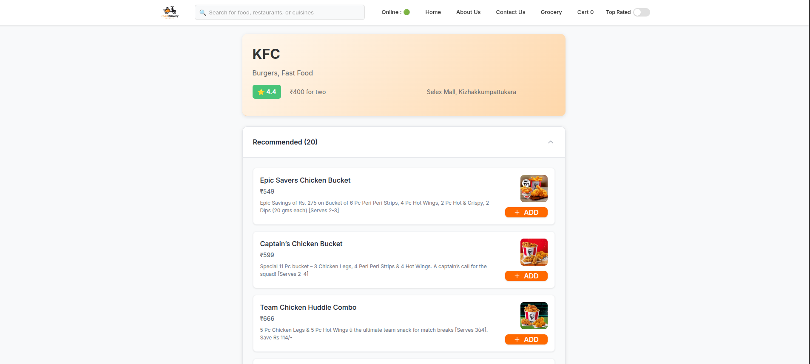
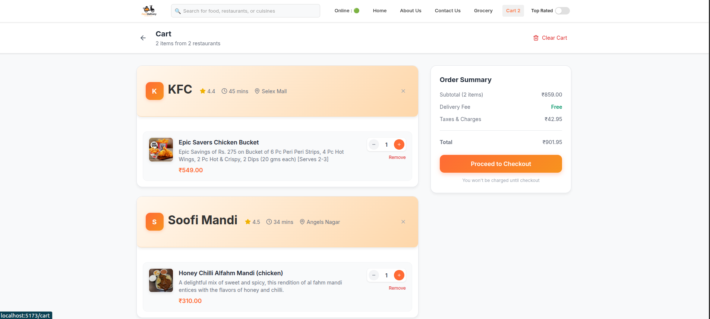
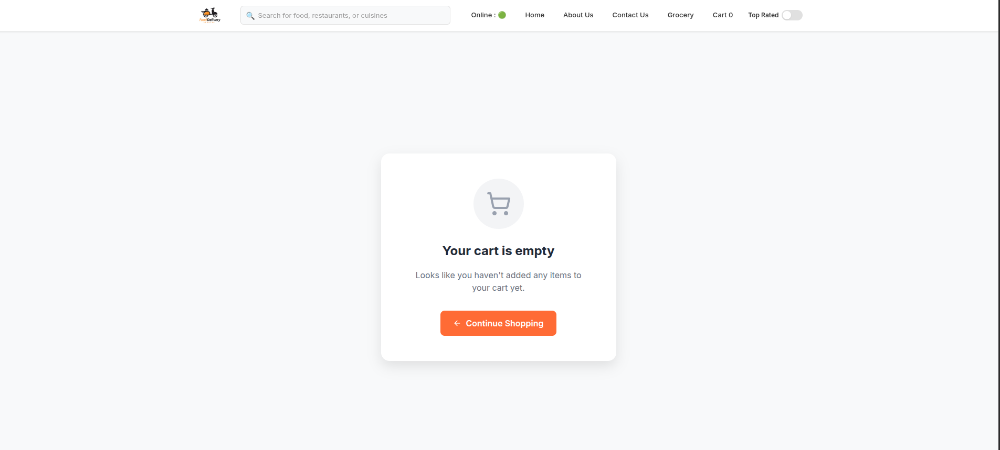

# Food Delivery App - Learning Project

A React learning project inspired by food delivery apps like Swiggy. This project demonstrates modern web development concepts including component architecture, state management, responsive design, and dynamic data rendering.

## Rough UI Sketch



## Project Screenshots








## How to Run Locally

1. **Clone the repository**

   ```bash
   git clone https://github.com/AISWARYAJAYADAS/namaste-react.git
   cd namaste-react
   ```

2. **Install dependencies**

   ```bash
   npm install
   ```

3. **Start development server**

   ```bash
   npm run dev
   ```

4. **Open in browser**
   ```
   http://localhost:5173
   ```

## Tech Stack

- React 19
- Vite
- React Router
- Redux Toolkit
- Tailwind CSS
- Lucide React
- Vitest

## Features

- Restaurant listing with real-time data from Swiggy API
- Search and filter functionality
- Individual restaurant menu pages with categorized items
- Shopping cart with add/remove functionality
- Order summary with delivery fee and tax calculations
- Responsive design for desktop and mobile
- Loading states and error handling
- Online/offline status indication

## Key Components

- **Header**: Logo, search, navigation, and cart indicator
- **Body**: Restaurant listing with search and filter capabilities
- **RestaurantMenu**: Menu display with categories
- **Cart**: Shopping cart with order summary
- **RestaurantCard**: Restaurant display with promotional labels

## Testing

```bash
npm test
npm run test:watch
```
